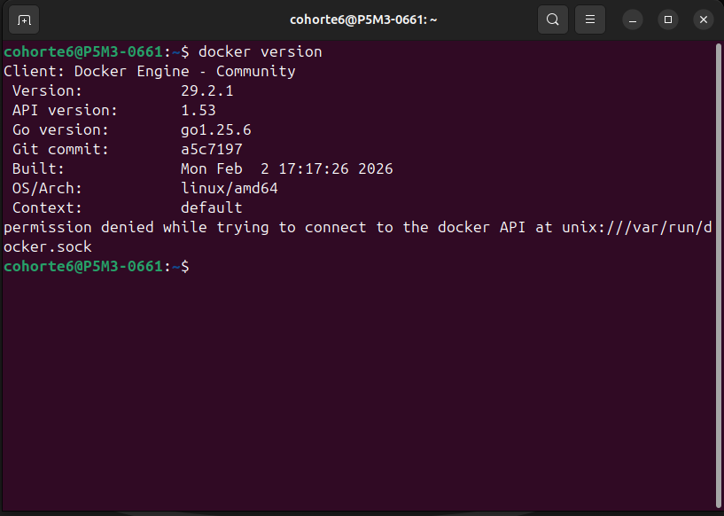

# Como Desplegar una Base de Datos desde el LocalHost Utilizando Postgres y Multer.

## Paso 1. Descargar Docker
El primer paso consta de ir al sitipo oficial de 
:::note Link de la Pagina Oficial
https://hub.docker.com/
:::

Aunado a esto, podemos verificar desde la terminal de Linux si tenemos descargado Docker, mediante el comando: 
```
docker version
```


## Paso 2. Instalar Postgres desde modularizado.
Ahora debes dirigirte a la pagina principal de Docker, una vez allí, te ubicas en en la seccion de busqueda donde dice "Search Docker Hub " y digira PostgresSQL.


